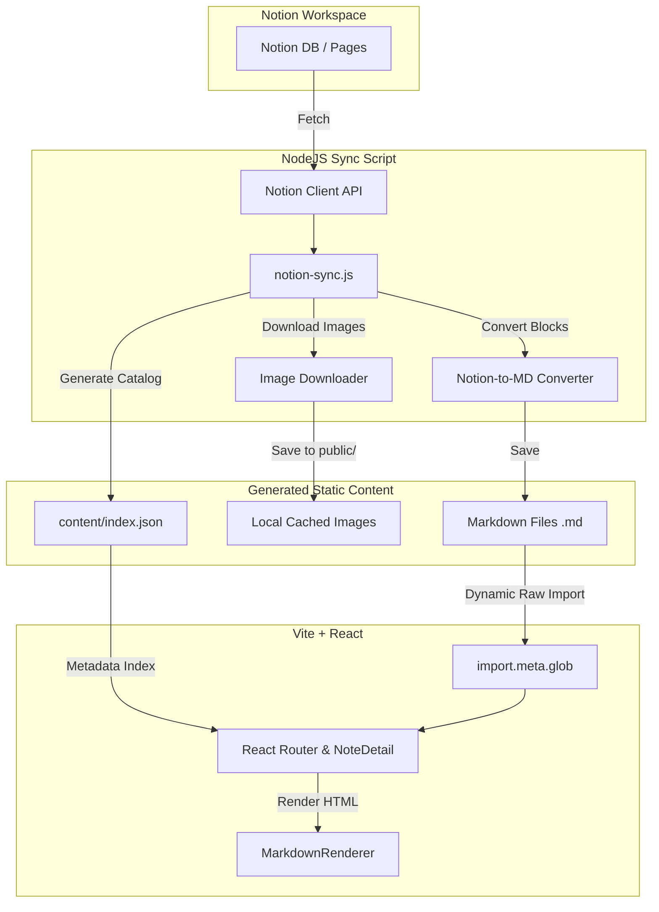

I love Notion. It’s where I brainstorm, draft technical articles, and sketch out reference notes. But when I wanted to display these notes on my personal portfolio, I faced a dilemma.


I didn’t want to copy-paste markdown files manually, nor did I want to build a clunky custom database admin panel. I wanted to write in Notion, hit save, run a script, and see my changes live instantly.


So, I built a custom **Notion-to-Markdown Sync Engine** using Notion, Node.js, and React.


Here is exactly how it works, the technical hurdles I had to solve (like Notion’s expiring image URLs), and why this hybrid static-site setup makes my portfolio incredibly fast.


---


## Why I Love This Setup

- **Zero Hosting Cost & API Fees**: Notion is only queried during the build step. A visitor reading my notes triggers exactly zero API requests to Notion.
- **Write Naturally**: I write in the native Notion app. Sub-headings, bullet lists, code snippets, and callouts translate into clean, semantic Markdown.
- **Blazing Fast performance**: It runs like a fully static site generator (SSG) but with client-side routing.
- **Version Controlled Content**: All markdown files and downloaded images are committed to git, creating a chronological history of my notes.

If you are looking to build a blog or portfolio, I highly recommend this approach. It keeps your writing flow friction-free while maintaining complete control over your frontend speed and styling.


---


## The Core Architecture: Split Build & Runtime


Querying the Notion API directly from a user’s browser is a bad idea. It’s slow, exposes credentials, and hits rate limits quickly.


Instead, my integration uses a **two-phase architecture**:

1. **Build-Time Sync (Node.js)**: A script pulls content from Notion, downloads and caches S3 media locally, formats the metadata into YAML Front Matter, and writes flat `.md` files.
2. **On-Demand Rendering (Vite + React)**: The React app dynamically lazy-loads only the requested Markdown file directly in the browser.




---


## Deep Dive 1: Cascading Page Resolution


Notion databases are tricky. Depending on how you structure your workspace, your parent ID could be a direct database, a standard page with nested subpages, or a page containing an inline database.


To make the sync process seamless, I wrote a cascading fallback function called `getPages()`. It queries Notion sequentially until it finds content:


```javascript
async function getPages(parentId) {
  // 1. Try querying directly as a database first
  try {
    const dbResponse = await notion.dataSources.query({ data_source_id: parentId });
    return parseDbResults(dbResponse.results);
  } catch (err) { /* Not a database? Move to step 2 */ }

  // 2. Query page blocks instead
  const childrenResponse = await notion.blocks.children.list({ block_id: parentId });

  // 3. Scan for inline databases inside the page
  const childDatabases = childrenResponse.results.filter(b => b.type === "child_database");
  if (childDatabases.length > 0) {
    return queryDatabase(childDatabases[0].id);
  }

  // 4. Fallback: Treat as a page containing nested sub-pages
  const childPages = childrenResponse.results.filter(b => b.type === "child_page");
  return retrieveIndividualPages(childPages);
}
```


This cascading logic means I don’t have to worry about strict structure limits in Notion. I write wherever is convenient.


---


## Deep Dive 2: Defeating the “Expiring S3 Image URL” Issue


This was the biggest roadblock.

> [!WARNING]  
> Notion hosts uploaded media on AWS S3 with signed URLs that **expire after exactly one hour**. If you link to these S3 URLs directly on a blog post, all of your images will break 60 minutes after you run the sync.

To solve this, my sync script intercepts the Markdown conversion, extracts image links using regex, downloads them, and updates the markdown to point to local assets:


```javascript
const imageRegex = /!\[(.*?)\]\((https?:\/\/.*?)\)/g;
// ... loop through all images inside the post
const localImagePath = path.join(imagesDir, `${slug}-${imageIndex}.${ext}`);
await downloadImage(imageUrl, localImagePath);

// Rewrite the image reference to a static web asset route
const relativeUrl = `/content-images/${type}/${slug}-${imageIndex}.${ext}`;
markdownContent = markdownContent.replace(imageUrl, relativeUrl);
```


By storing images in my `public` folder and replacing the URLs, they are permanently cached, served locally, and versioned right inside my Git repository.


---


## Deep Dive 3: Lazy Loading Markdown Client-Side


Now that the build script writes local Markdown files to `/content/notes/*.md`, how does React load them without bloating the initial JavaScript bundle?


I used **Vite’s glob imports** with dynamic lazy loading.


In NoteDetail.jsx (The react component which render the markdown), instead of importing all files statically, Vite creates a map of unresolved promises:


```javascript
const noteModules = import.meta.glob("/content/notes/*.md", { query: "?raw", import: "default" });
```


When a user visits a route like `/notes/express-js-notes`, React dynamically resolves the single file raw markdown content in `useEffect`:


```javascript
useEffect(() => {
  async function loadMarkdown() {
    const fileKey = `/content/notes/${slug}.md`;
    if (noteModules[fileKey]) {
      const rawText = await noteModules[fileKey](); // Fetch file contents dynamically
      const { metadata, body } = parseMarkdown(rawText);
      setContent(body);
      setNoteMeta(metadata);
    }
  }
  loadMarkdown();
}, [slug]);
```


This approach yields the best of both worlds:
1. The initial page load is incredibly tiny because notes are not bundled into the main JS package.
2. The user experience is smooth because files load nearly instantly as lightweight `.md` text assets.


## **See the Code in Action**


Want to see the full source code for this integration? Check out the repository on GitHub: [https://github.com/Premdeeppd/portfolio](https://github.com/Premdeeppd/portfolio)

