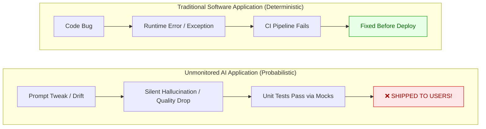
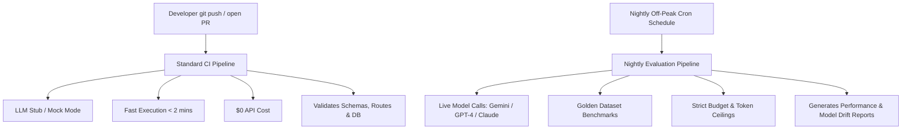
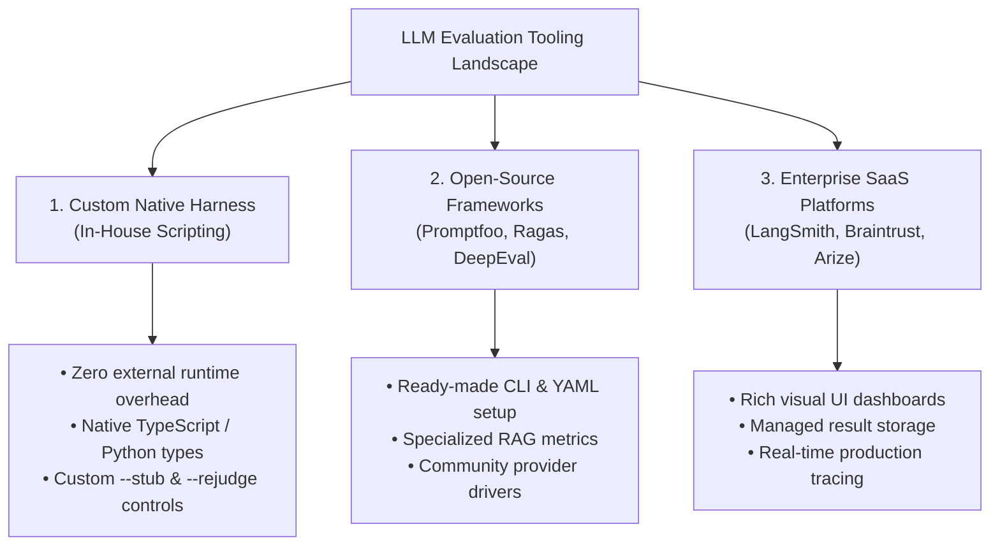
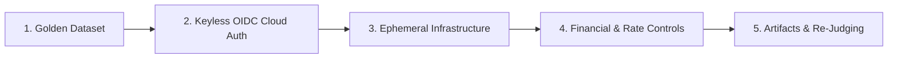
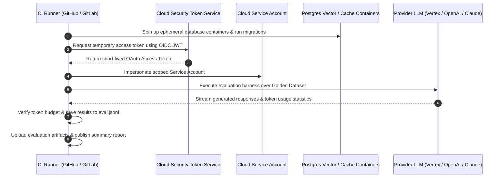

_A guide on building a production-grade Continuous Evaluation (CE) system for Large Language Models._


## 1. The Silent Crisis in Production AI


Imagine shipping a traditional backend service where 15% of your API responses silently return incorrect data, but **not a single exception is logged, no HTTP 500 error is triggered, and every unit test passes with flying colors.**


In traditional software engineering, this would trigger an emergency P0 incident call. In modern AI application development, **this is the default state of unmonitored LLM systems.**





### The 4 Silent Killers of AI Applications

1. **The Stealth Quality Drop:** You tweak a system prompt or adjust Retrieval-Augmented Generation (RAG) parameters. Your API handler returns `200 OK`, but output factual accuracy drops from 92% to 74%. Without continuous benchmarks, you won’t know until customer churn spikes.
2. **Foundation Model Drift:** Cloud LLM providers continuously update backend model weights. A prompt that generated clean JSON last month might start producing markdown-wrapped code blocks today after a quiet model update.
3. **Financial & Latency Leakage:** A minor prompt addition or extra context window expansion can silently double your average input token count, inflating your monthly cloud bill by thousands of dollars and adding 800ms of latency without throwing any errors.
4. **Erosion of User Trust:** In production AI products, a single confident hallucination damages customer trust far more than a temporary UI downtime.

Continuous Evaluation (CE) via a scheduled **Nightly Evaluation Pipeline (****`eval-nightly`****)** is not a luxury—it is the engineering discipline that separates toy LLM wrappers from resilient, production-ready AI products.


## 2. The Paradigm Shift: Decoupling CI from Continuous Evaluation (CE)


Building production-grade AI systems requires rethinking Software Quality Assurance.


In traditional software development, Continuous Integration (CI) is **deterministic**: input A always yields output B.


With LLMs, system behavior becomes **probabilistic**:

- **Harness correctness ≠ Model capability:** A passing test suite with stubbed or mocked LLM calls proves your API routes, database models, and response validators work. It tells you **nothing** about whether the model’s responses are accurate, helpful, safe, or contextually aligned.
- **Live LLM testing on every pull request is unsustainable:** Calling live LLM APIs on every git commit creates two major engineering bottlenecks:
1. **Exorbitant API Costs:** Running full evaluation benchmarks across dozens of PR commits a day burns thousands of dollars needlessly.
2. **Developer Velocity Friction:** Evaluation runs over representative datasets take minutes or hours. A CI pipeline that blocks merges for 30 minutes gets bypassed or disabled by developers.

### The Solution: The Two-Tiered Evaluation Model





By establishing a **Nightly Evaluation Pipeline**, you decouple deterministic code verification from probabilistic model evaluation. Developers iterate rapidly during the day with instant mock CI feedback, while the nightly pipeline monitors model quality, prompt efficacy, and cost regressions off-peak.


## 3. Build vs. Buy: The LLM Evaluation Tooling Landscape


When architecting a continuous evaluation pipeline, engineering teams face a key choice: **build a lightweight custom evaluation runner or adopt external frameworks.**





### Approach A: Custom Native Evaluation Harness


Writing a lightweight, custom evaluation runner in your project’s native language (e.g., TypeScript or Python):

- **Best when:** You want zero external dependencies, seamless integration with your existing domain models, full control over token budget capping, and offline `.jsonl` re-judging.

### Approach B: Open-Source Evaluation Frameworks


Using developer-focused open-source evaluation tools:

- **Promptfoo:** Excellent CLI tool for CI/CD pipelines configured via YAML with built-in assertion plugins (`llm-rubric`, `embedding-similarity`, `json-schema`).
- **Ragas:** Specialized framework for RAG applications calculating metrics like _Context Precision_, _Context Recall_, and _Faithfulness_.
- **DeepEval / TruLens:** PyTest/Jest-style frameworks for writing unit tests against LLM responses.

### Approach C: Managed SaaS Evaluation Platforms


Adopting enterprise observability platforms:

- **LangSmith / Braintrust / Arize Phoenix:** Provide web dashboards, prompt versioning, dataset curation UI, and live production tracing.

## 4. Architectural Blueprint: The 5 Pillars of a Production `eval-nightly`


A robust nightly evaluation system relies on five architectural pillars:





### Pillar 1: The Golden Dataset


The golden dataset is a curated benchmark suite containing:

- **Edge-case inputs:** Multi-turn reasoning prompts, ambiguous user inputs, and complex context windows.
- **Known regressions:** Real user queries that previously caused failures or hallucinations.
- **Ground truth targets:** Expected answers, acceptable semantic bounds, or scoring rubrics used by automated judges.

### Pillar 2: Keyless Cloud Authentication (Workload Identity Federation)


Storing long-lived API keys or service account JSON secrets inside repository settings is a high-risk security practice.

- **The Modern Standard:** Use OpenID Connect (OIDC) via **Workload Identity Federation (WIF)** or AWS IRSA.
- The CI runner mints a short-lived JWT token, which the cloud provider exchanges for a temporary access token scoped strictly to a single execution.

### Pillar 3: Isolated Ephemeral Infrastructure


Evaluation runs must execute against clean, reproducible environments:

- Provision fresh service containers (e.g., PostgreSQL with vector extensions, Redis) using explicit health checks (`pg_isready`).
- Never run evaluations against shared development or staging databases to prevent data pollution.

### Pillar 4: Hard Financial Ceilings & Concurrency Controls


Unbounded loops against live LLM APIs can accidentally burn thousands of dollars overnight.

- **Token Budget Caps (****`--budget`****):** Hard stopping criteria that halt execution gracefully if token usage crosses a set limit (e.g., 4,000,000 tokens).
- **Downsampling (****`--sample N`****):** Options to execute every Nth test case during trial runs.
- **Concurrency Limits (****`--concurrency N`****):** Parallel request caps to prevent hitting HTTP 429 `ResourceExhausted` rate limits.
- **Non-Canceling Concurrency Groups:** Configuring CI settings (`cancel-in-progress: false`) so in-flight evaluation runs aren’t aborted mid-stream. In-flight runs have already been paid for; completing them preserves checkpoint data.

### Pillar 5: Persistent Artifacts & Offline Re-Judging

- Save raw evaluation outputs into machine-readable formats (`.jsonl`) alongside summary logs (`.txt`).
- Upload raw output files as build artifacts. If judge scoring prompts change later, you can re-judge historical output logs offline (`-rejudge`) for **$0 generation API cost**.

---


## 5. How a Nightly Pipeline Operates Under the Hood


Here is the sequence of events when an automated nightly evaluation pipeline fires:





---


## 6. Gotchas & Best Practices

> [!IMPORTANT]  
> **Enforce Least-Privilege IAM Roles**  
> Never grant `Owner` or `Editor` roles to CI service accounts. Assign **only** invocation permissions (e.g., `roles/aiplatform.user` on GCP) and restrict Workload Identity bindings strictly to your specific repository path (`attribute.repository == 'org/repo'`).
> [!WARNING]  
> **Beware the OIDC Trailing Slash Trap**  
> Cloud OIDC providers enforce exact string matching on issuer URLs. Setting an issuer URL with a trailing slash (`https://token.actions.githubusercontent.com/`) will cause authentication token exchange failures. Always omit trailing slashes.
> [!TIP]  
> **Mitigating Non-Determinism in Evaluations**  
> Set `temperature: 0` for evaluation calls requiring reproducible scoring, and leverage structured outputs (JSON Schema / Zod validation) for automated judges.

---


## 7. Reference Implementation


Below is a production-ready, standalone GitHub Actions workflow file that implements this architecture:


```yaml
name: Continuous Evaluation (Nightly)

on:
schedule:
    # Run off-peak at 02:30 UTC
-cron:'30 2 * * *'
workflow_dispatch:
inputs:
sample:
description:'Sample rate (e.g. 3 = run every 3rd case)'
required:false
default:'1'
type: string
model:
description:'Model override (e.g. gemini-1.5-pro, gpt-4o)'
required:false
type: string

concurrency:
group: eval-nightly
cancel-in-progress:false

jobs:
evaluate:
name: Run Golden Set Benchmark
runs-on: ubuntu-latest
timeout-minutes:60

permissions:
contents: read
id-token: write

services:
postgres:
image: pgvector/pgvector:pg16
env:
POSTGRES_USER: test_user
POSTGRES_DB: test_db
ports:['5432:5432']
        options:>-
          --health-cmd "pg_isready -U test_user"
          --health-interval 5s --health-timeout 5s --health-retries 10

env:
NODE_ENV: test
AI_STUB_MODE:'off'
GOOGLE_CLOUD_PROJECT: ${{ secrets.GOOGLE_CLOUD_PROJECT }}

steps:
-uses: actions/checkout@v4
-uses: actions/setup-node@v4
with:
node-version:20

      # Keyless Cloud Authentication via Workload Identity Federation
-id: auth
uses: google-github-actions/auth@v2
with:
workload_identity_provider: ${{ secrets.GCP_WORKLOAD_IDENTITY_PROVIDER }}
service_account: ${{ secrets.GCP_SERVICE_ACCOUNT }}

-run: npm ci
-run: npm run db:migrate

      # Run evaluation script with strict token budget and concurrency limits
-name: Execute Golden Benchmark Suite
        run:|
          npx tsx scripts/eval.ts \
            --sample ${{ inputs.sample || '1' }} \
            --concurrency 3 \
            --budget 4000000 \
            --results "$RUNNER_TEMP/eval-results.jsonl" \
            | tee "$RUNNER_TEMP/eval-report.txt"
env:
MODEL_OVERRIDE: ${{ inputs.model || '' }}

      # Upload raw evaluation output for auditing & offline re-judging
-if: always()
uses: actions/upload-artifact@v4
with:
name: eval-artifacts
          path:|
            ${{ runner.temp }}/eval-results.jsonl
            ${{ runner.temp }}/eval-report.txt
retention-days:30

      # Publish summary directly to GitHub Actions Dashboard
-if: always()
name: Publish Summary
        run:|
          {
            echo '### 📊 Evaluation Run Summary'
            echo '```'
            cat "$RUNNER_TEMP/eval-report.txt" || echo 'No report generated'
            echo '```'
          } >> "$GITHUB_STEP_SUMMARY"
```

