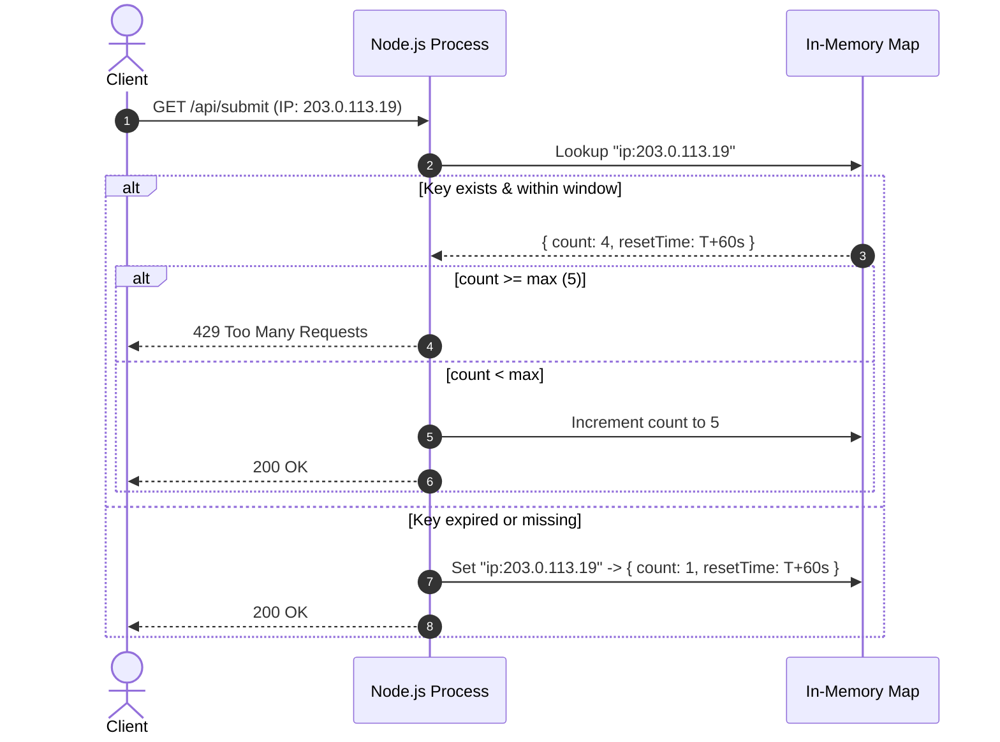
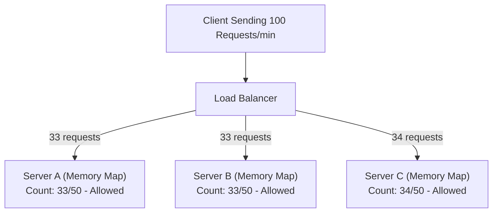
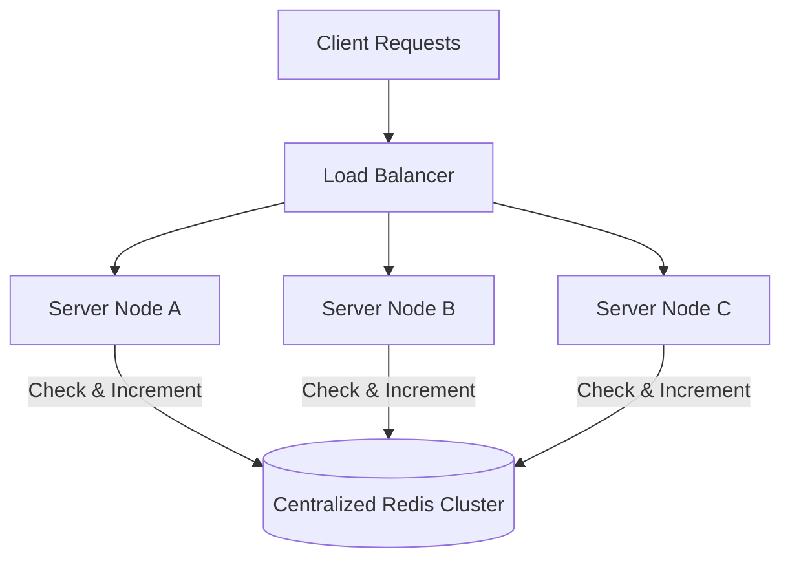
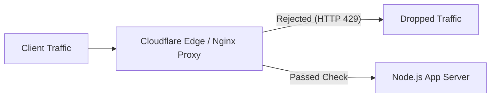

# Overview


When building web applications and backend APIs, one of the first security challenges you run into is protecting your endpoints from abuse. Whether it’s a bot spamming a login route, someone uploading massive files continuously, or a script scraping your database, rate limiting is the primary tool to handle these issues.


When I first started implementing rate limiting, I built a quick in-memory map directly inside my Node.js application. It worked great during local testing, but as I learned more about modern cloud architecture, horizontal scaling, and serverless environments, I realized that simple in-memory rate limiting has real limitations in production.


In this article, I will share everything I learned while building and exploring rate limiting strategies:

1. **In-Memory Rate Limiting**: Building a TypeScript limiter from scratch, calculating memory overhead, and understanding why it fails across multiple server nodes.
2. **Distributed Rate Limiting with Redis**: Solving multi-instance state sharing, sliding window counters, and atomic Lua scripts.
3. **Edge / API Gateway Rate Limiting**: Handling traffic spikes at Nginx or Cloudflare before requests hit your Node.js application code.
4. **Comparison Matrix**: Deciding which architecture fits your project needs.

# Why Rate Limiting Matters


Rate limiting controls how often a client can send requests to your server within a specific timeframe. Without it, any public HTTP endpoint is exposed to several risks:

- **Denial of Service (DoS)**: High volumes of requests overwhelming compute resources.
- **Brute-Force Attacks**: Bots rapidly testing credentials on login endpoints.
- **Resource Exhaustion**: Users repeatedly hitting expensive operations like file uploads, PDF rendering, or paid third-party AI APIs.

When your server rejects a request due to rate limits, the standard convention is to return an **HTTP 429 (Too Many Requests)** status code along with descriptive headers:


```plain text
HTTP/1.1 429 Too Many Requests
Retry-After: 30
X-RateLimit-Limit: 10
X-RateLimit-Remaining: 0
X-RateLimit-Reset: 1774154400
```


# Strategy 1: In-Memory Rate Limiting (Application Layer)


### How It Works


In-memory rate limiting stores request counts directly inside your running Node.js process using standard memory objects like JavaScript `Map` or an LRU Cache.


When a client sends a request, the app extracts an identifier (such as their User ID or IP address), looks it up in memory, and checks if their request count is still within allowed boundaries.





### Building an In-Memory Limiter in TypeScript


Here is a clean implementation of a sliding window rate limiter in TypeScript, complete with an automated cleanup routine to prevent stale keys from lingering in memory:


```typescript
import { NextRequest } from "next/server";

interface RateLimitRecord {
  count: number;
  resetTime: number;
}

export class InMemoryRateLimiter {
  private windowMs: number;
  private maxRequests: number;
  private maxSize: number;
  private store: Map<string, RateLimitRecord>;

  constructor(windowMs: number, maxRequests: number, maxSize: number = 10000) {
    this.windowMs = windowMs;
    this.maxRequests = maxRequests;
    this.maxSize = maxSize;
    this.store = new Map();
  }

  public check(key: string): {
    success: boolean;
    limit: number;
    remaining: number;
    resetTime: number;
  } {
    const now = Date.now();
    const record = this.store.get(key);

    // Evict oldest entries if capacity is reached
    if (this.store.size >= this.maxSize && !record) {
      this.evictOldestExpired(now);
    }

    // New window or expired record
    if (!record || now > record.resetTime) {
      const resetTime = now + this.windowMs;
      this.store.set(key, { count: 1, resetTime });
      return {
        success: true,
        limit: this.maxRequests,
        remaining: this.maxRequests - 1,
        resetTime,
      };
    }

    // Limit reached
    if (record.count >= this.maxRequests) {
      return {
        success: false,
        limit: this.maxRequests,
        remaining: 0,
        resetTime: record.resetTime,
      };
    }

    // Increment request count
    record.count += 1;
    return {
      success: true,
      limit: this.maxRequests,
      remaining: this.maxRequests - record.count,
      resetTime: record.resetTime,
    };
  }

  public cleanup(): void {
    const now = Date.now();
    for (const [key, record] of this.store.entries()) {
      if (now > record.resetTime) {
        this.store.delete(key);
      }
    }
  }

  private evictOldestExpired(now: number): void {
    for (const [key, record] of this.store.entries()) {
      if (now > record.resetTime) {
        this.store.delete(key);
      }
    }
    // Fallback FIFO cleanup if map remains full
    if (this.store.size >= this.maxSize) {
      const firstKey = this.store.keys().next().value;
      if (firstKey) this.store.delete(firstKey);
    }
  }
}

// Client Identifier Helper
export function getClientIdentifier(req: NextRequest, userId?: string | null): string {
  if (userId) return `user:${userId}`;

  const forwarded = req.headers.get("x-forwarded-for");
  if (forwarded) {
    const ip = forwarded.split(",")[0].trim();
    if (ip) return `ip:${ip}`;
  }

  const realIp = req.headers.get("x-real-ip");
  if (realIp) return `ip:${realIp.trim()}`;

  return "ip:anonymous";
}
```


### Memory Footprint Math


I wanted to measure how much memory an in-memory map takes. In Node.js (V8 engine), a `Map` storing a string key and an object like `{ count: 3, resetTime: 1774154400000 }` uses about **120 to 150 bytes**:


| Active Unique Keys | Memory Usage per Entry | Total Memory Consumption |
| ------------------ | ---------------------- | ------------------------ |
| **1,000**          | ~120 Bytes             | ~120 KB                  |
| **10,000**         | ~120 Bytes             | ~1.2 MB                  |
| **100,000**        | ~120 Bytes             | ~12.0 MB                 |


As long as you clean up expired keys periodically, the RAM usage for in-memory rate limiting is tiny.


### Where In-Memory Rate Limiting Works Well

- **Single-Server Deployments**: Simple VPS apps (DigitalOcean, AWS EC2), monolithic Docker containers, or internal admin tools running on one Node.js instance.
- **Prototyping & MVPs**: Zero setup time, zero external infrastructure costs, and zero network latency.

### Why In-Memory Rate Limiting Fails in Real Production


While in-memory rate limiting is fast and free, it breaks down when you scale up. Here is why:


Problem 1: Horizontally Scaled Multi-Instance Clusters


When you deploy your app across multiple load-balanced servers (for example, Server A, Server B, and Server C), each server has its own separate memory space.





Because Server A doesn’t know about requests hitting Server B or C, a client with a limit of 50 requests/min can actually make **150 requests/min** across your 3 servers.


Problem 2: Serverless Functions (Vercel, AWS Lambda, Cloud Run)


Serverless containers are created and destroyed dynamically based on incoming traffic. Every cold start spins up a fresh container with an empty memory map, rendering in-memory rate limiters completely ineffective.


Problem 3: Deployments & Server Restarts


Every time you push new code or restart your application process, Node.js memory clears out completely, resetting all client rate limit counts.


# Strategy 2: Distributed Rate Limiting (Redis)


### How It Works


To solve the multi-instance split-state issue, all application nodes connect to a single, fast, centralized memory store—most commonly **Redis**.





Whether a user’s request hits Server A or Server B, both servers read from and write to the same central Redis database.


### Atomic Rate Limiting with Redis Lua Scripts


If two requests hit Redis at the exact same millisecond, read-then-write operations can lead to race conditions. To handle this, we use a **Redis Lua script**, which executes atomically inside Redis.


```lua
-- KEYS[1]: Rate limit key (e.g. "ratelimit:user_123")
-- ARGV[1]: Current timestamp in ms
-- ARGV[2]: Window size in ms (e.g. 60000)
-- ARGV[3]: Max allowed requests
-- ARGV[4]: Unique request ID

local key = KEYS[1]
local now = tonumber(ARGV[1])
local window = tonumber(ARGV[2])
local max_requests = tonumber(ARGV[3])
local clear_before = now - window

-- 1. Remove timestamps older than the sliding window
redis.call('ZREMRANGEBYSCORE', key, 0, clear_before)

-- 2. Count current request log
local current_requests = redis.call('ZCARD', key)

-- 3. Reject if limit reached
if current_requests >= max_requests then
    return {0, current_requests}
else
    -- Add timestamp to sorted set
    redis.call('ZADD', key, now, ARGV[4])
    redis.call('PEXPIRE', key, window)
    return {1, current_requests + 1}
end
```


### TypeScript Code Example using Upstash Redis


```typescript
import { Redis } from "@upstash/redis";
import { Ratelimit } from "@upstash/ratelimit";

const redis = new Redis({
  url: process.env.UPSTASH_REDIS_REST_URL!,
  token: process.env.UPSTASH_REDIS_REST_TOKEN!,
});

export const distributedRateLimiter = new Ratelimit({
  redis: redis,
  limiter: Ratelimit.slidingWindow(10, "10 s"),
  analytics: true,
  prefix: "@ratelimit/api",
});

export async function enforceRateLimit(identifier: string) {
  const { success, limit, remaining, reset } = await distributedRateLimiter.limit(identifier);

  if (!success) {
    return {
      allowed: false,
      statusCode: 429,
      headers: {
        "X-RateLimit-Limit": String(limit),
        "X-RateLimit-Remaining": String(remaining),
        "X-RateLimit-Reset": String(reset),
        "Retry-After": String(Math.ceil((reset - Date.now()) / 1000)),
      },
    };
  }

  return { allowed: true };
}
```


### Trade-offs of Distributed Redis Rate Limiting


Advantages:

- **Global Consistency**: All server instances and serverless functions share identical counts.
- **Persistent Across Deployments**: Application redeploys do not reset client limits.
- **Race-Condition Safe**: Lua scripts guarantee atomic execution.

Disadvantages:

- **Added Latency**: Every HTTP request needs a round-trip to Redis, adding 2ms to 20ms of network overhead.
- **External Dependency**: If Redis goes down, you must decide whether your app fails open (allows all requests) or fails closed (blocks all requests).

# Strategy 3: Edge & API Gateway Rate Limiting


### How It Works


Instead of letting abusive traffic enter your application server to run JavaScript code, you can intercept and block requests at the infrastructure layer—using tools like Cloudflare, Nginx, or AWS WAF.





### Example: Nginx Rate Limiting Configuration


In Nginx, rate limiting can be configured directly in your `nginx.conf`:


```plain text
# Allocate a 10MB memory zone, allowing max 10 requests per second per IP
limit_req_zone $binary_remote_addr zone=api_limit:10m rate=10r/s;

server {
    listen 80;
    server_name api.example.com;

    location /api/ {
        # Allow small bursts up to 5 extra requests
        limit_req zone=api_limit burst=5 nodelay;

        proxy_pass http://backend_cluster;
        proxy_set_header Host $host;
        proxy_set_header X-Real-IP $remote_addr;
    }
}
```


### Why Edge Gateways Help High-Traffic Apps

1. **Zero App Overhead**: Malicious requests are rejected before Node.js spends any CPU cycles parsing JSON or allocating memory.
2. **DDoS Protection**: Edge networks like Cloudflare can absorb massive traffic floods that would otherwise overwhelm backend event loops.

## Practical Recommendations


Building and exploring rate limiting made me realize that there is no single “perfect” approach—it depends entirely on how your application is deployed:

- **For MVPs, single VPS setups, or internal microservices**: **In-Memory Rate Limiting** is easy to implement, costs nothing, and adds zero latency.
- **For horizontally scaled apps and serverless environments**: **Distributed Redis Rate Limiting** is essential to maintain accurate, global counts across instances.
- **For public-facing applications receiving heavy traffic**: Combining **Edge Gateways** (for volumetric protection) with **Redis** (for custom application quotas) gives you a solid defense-in-depth architecture.
