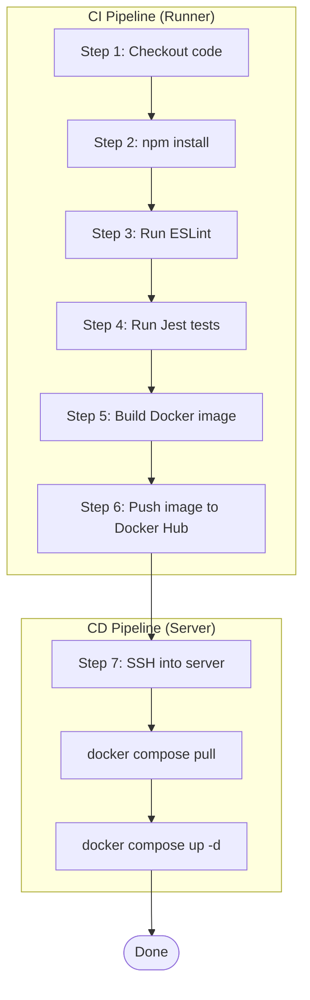

- CI/CD stands for Continuous Integration and Continuous Deployment.
- It is a software development practice that automates testing and deployment so developers can ship code faster and more reliably.

# Continuous Integration (CI)

- Think of CI as an automated quality inspector.
- Every time someone pushes code, automatically verify that nothing is broken.
- When someone pushes code, it immediately starts an automated pipeline.

    ```plain text
    ✓ Install dependencies
    ✓ Compile project
    ✓ Run linting
    ✓ Run unit tests
    ✓ Run integration tests
    ✓ Security scanning
    ✓ Build Docker image
    ```

- If any step fails, Build fail and developer need to fix it before merging.
- If everything passes, Safe to merge.

# Continuous Deployment (CD)

- Every successful commit reaches production automatically.

    ```plain text
    git push main
    ↓
    Tests pass
    ↓
    Deploy
    ↓
    Website updated
    ```


# A Typical CI/CD Pipeline





# Github Actions

- A popular tool for defining and running CI/CD workflows directly from your GitHub repository.
- Github says, Whenever something happens in your repository, I can automatically execute a series of commands for you.
- Those "something happens" events are called **events**. And there are:
    - Someone pushes code
    - Someone opens a pull request
    - someone creates a release
    - Someone adds a tag.
- When an event occurs, GitHub starts a temporary machine and executes your instructions.
- Just like Docker containers are **ephemeral**, GitHub Action runners are also **ephemeral**. Every workflow starts from a clean machine.

## What is Github action runner?

- A runner is the computer that executes the workflow.
- For example, let’t the yaml file mentions, `runs-on: ubuntu-latest`
    - Means, GitHub, create an Ubuntu machine for me.
    - And that machine roughly looks like:

        ```plain text
        Ubuntu VM
        
        ✓ Git installed
        ✓ Docker installed
        ✓ Node can be installed
        ✓ Python available
        ✓ Java available
        ✓ Internet access
        
        # Your repo is not there yet, it's just empty ubuntu machine.
        ```


## The life of a Github action workflow

- Let’s say you push your express backend

    ```plain text
    git push origin main
    ```

- Here's what happens:

    ```plain text
    You
     │
     │ Push
     ▼
    GitHub Repository
     │
     │ Detect event
     ▼
    Creates Ubuntu Runner
     │
     ▼
    Downloads your repository
     │
     ▼
    Runs your commands
     │
     ▼
    Reports Success/Failure
     │
     ▼
    Deletes the runner
    ```

- The runner exist only for that workflow.
- A workflow is divided into **jobs** like `build job`, and each job contains **steps**. Like, build job will have steps — install node, install dependencies, run test, build app, etc. If any step fails, everything stops.
- A workflow can have **one or many jobs**, and each job runs on its **own fresh runner** by default.

## Where do Github action workflows live?

- Github looks for a special folder:

    ```plain text
    .github/
    └── workflows/
          backend.yml
          frontend.yml
          deploy.yml
    ```

- Every `.yml` file inside this directory is a workflow.
- An example of simple Github action workflow:

    ```yaml
    name: Build Backend
    
    on:
      push:
        branches:
          - main
    
    jobs:
      build:
        runs-on: ubuntu-latest
    
        steps:
          - uses: actions/checkout@v4
    
          - uses: actions/setup-node@v4
            with:
              node-version: 22
    
          - run: npm install
    
          - run: npm test
    
          - run: npm run build
    ```


## Github Artifacts

- A new runner has no knowledge of the previous runner. It doesn't have your compiled files, installed npm packages, or Docker images unless you explicitly transfer them.
- Artifacts helps in transferring files between jobs in the same workflow.
- Think of artifacts as a courier service. This the what happens under the hood:

    ```plain text
    Runner #1
    
    dist/
    
    │
    │ Upload
    ▼
    
    GitHub Storage
    
    │
    │ Download
    ▼
    
    Runner #2
    ```

- The file is temporarily stored by GitHub.

## Github cache in workflow

- Reuse expensive dependencies **across different workflow runs**.
- Every workflow starts with `npm install` , suppose your project has 1000 npm packages and downloading them every time might takes a lot of time. And if you push code several times a day, it’s a lot of wasted time.
- To solve this and make the process faster, Github stores them. Workflow can just restore the dependencies instead of downloading again.

## Cache key

- A **cache key** is a unique identifier used by GitHub Actions to store and retrieve cached files.
- It is usually generated from the **OS** and the hash of dependency lock files (e.g., `package-lock.json`).
- If the dependency file changes, its hash changes, producing a **new cache key**.
- If the key **matches** → **cache hit** → cached dependencies are restored.
- If the key **changes** → **cache miss** → dependencies are downloaded again and a new cache is saved.
- **Purpose:** Reuse only valid dependencies while avoiding stale caches.
